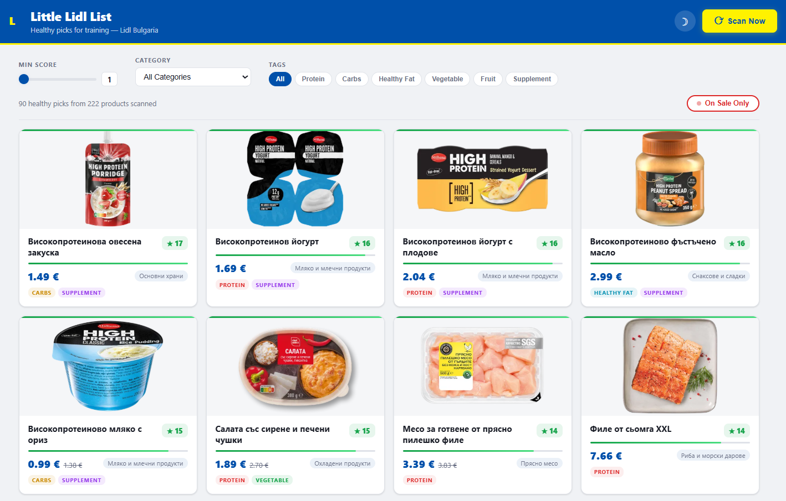

# Little Lidl List

Scan Lidl Bulgaria's weekly offers and find the best items for a training-focused diet. Automatically scrapes [lidl.bg](https://www.lidl.bg), scores products by nutritional value, and displays results in a visual web interface.



## Features

- **Scrapes 200+ products** across 16 food categories from Lidl Bulgaria
- **Health/fitness scoring** — ranks items by relevance for training (high protein, complex carbs, healthy fats, vegetables)
- **Product images** embedded directly in the UI
- **Sale filter** — toggle to show only discounted items
- **Category & tag filters** — filter by food category or nutritional tag (protein, carbs, healthy fat, vegetable, fruit, supplement)
- **Light/dark theme** — Lidl-branded color scheme with toggle
- **Caching** — scrape once, browse instantly with cached results
- **CLI** — terminal interface with Rich tables

## Setup

```bash
python -m venv .venv
.venv/Scripts/activate    # Windows
# source .venv/bin/activate  # Linux/macOS

pip install -e .
playwright install chromium
```

## Usage

### Quick Start (Windows)

Double-click **`start.bat`** — it handles setup on first run and launches the web UI.

### Web UI

```bash
python -m lidl.app
```

Opens the browser at `http://localhost:5000`. Click **🍽️ Meal Plan** in the
header to generate the 3-meal plan in a modal and save the image card or the
plain-text checklist straight from the browser.

### CLI

```bash
# Full scan (scrapes live, ~2 min)
lidl

# Use cached results
lidl --cache

# Top 20 picks with score >= 8
lidl --cache --top 20 --min-score 8

# Show the browser while scraping
lidl --no-headless

# List available categories
lidl --list-categories
```

## Daily summary digest

`lidl-summary` writes a Markdown digest of the items that are **on sale *and*
score well** for a training diet — the part worth acting on each week.

```bash
lidl-summary                 # scrape live, score >= 6, write today's digest
lidl-summary --cache         # use the last scrape instead of fetching
lidl-summary --min-score 8 --top 20
lidl-summary --input fx.json # score an explicit products JSON (for testing)
```

It writes `summaries/lidl-summary-<date>.md` and echoes it to stdout (so a
service journal captures it). "On sale" = the item carries a struck-through
old price.

The same run also chains a **meal plan** onto the digest (see below), so the
daily timer produces everything in one shot.

## Meal plan + phone exports

`lidl-mealplan` turns the on-sale healthy picks into three meals
(breakfast / lunch / dinner — each built around protein + complex carb + veg
or fruit, preferring the best-scoring discounted item per slot) plus a
deduplicated shopping list. It's also run automatically at the end of every
`lidl-summary`.

```bash
lidl-mealplan --cache        # plan from the last scrape (no fetching)
lidl-mealplan                # scrape live, then plan
lidl-mealplan --min-score 6  # raise the health bar for eligible items
lidl-mealplan --no-image     # Markdown + checklist only (skip the PNG)
```

It writes three phone-friendly exports into `summaries/`:

- `meal-plan-<date>.md` — the plan + shopping list as Markdown
- `meal-plan-<date>.png` — a shareable **image card** in the Lidl palette
  (rendered by screenshotting a branded HTML card with Playwright — no extra
  dependency)
- `shopping-list-<date>.txt` — a plain-text `[ ]` checklist to copy onto a phone

### Schedule it (daily, user systemd)

```bash
python -m venv .venv && .venv/bin/pip install -e .
.venv/bin/playwright install chromium    # needed for live scraping
./systemd/install.sh                      # installs + enables the 08:00 timer
```

The timer runs `lidl-summary --top 25` daily (`OnCalendar=*-*-* 08:00:00`,
`Persistent=true` so a missed run catches up). Inspect with
`systemctl --user list-timers little-lidl-summary.timer`.

## Scoring

Products are scored by keyword matching tuned for a training diet:

| Tag | Examples | Score boost |
|-----|----------|-------------|
| Protein | Chicken, salmon, eggs, cottage cheese, skyr, Greek yogurt | +7 to +9 |
| Complex carbs | Oats, rice, lentils, quinoa, sweet potato | +6 to +8 |
| Healthy fats | Olive oil, avocado, nuts, peanut butter | +6 to +8 |
| Vegetables | Broccoli, spinach, peppers, tomatoes | +5 to +8 |
| Fruit | Bananas, apples | +6 to +7 |

Junk food, alcohol, and heavily processed items receive negative scores.

## Tech Stack

- **Playwright** — headless Chromium for scraping the JS-rendered Lidl site
- **Flask** — lightweight web server and API
- **Rich** — terminal UI for the CLI
- **Vanilla JS/CSS** — no frontend framework needed
